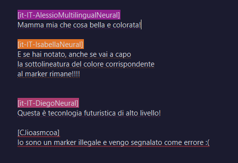
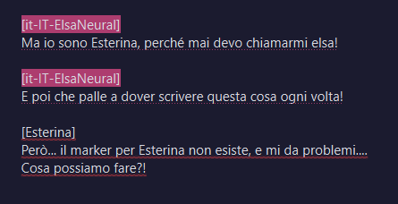
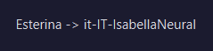
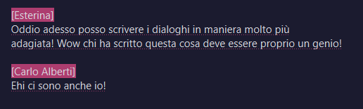

# ESTERINATOR
Najello

## NUOVA REGOLA DI SINTASSI
Per fare una cosa bella e pulita, adesso il marker [voce] dovrà stare in una riga dove compare da solo.

Se questa condizione non è condizionata, allora non permette di generare l'audio.

## ALIAS
Chiunque non sia distratto si sarà reso conto che scrivere i marker è un processo tedioso che distoglie l'attenzione dallo scopo di ***Esterinator***, ossia la scrittura.
Cercare il marker, trovarlo e premere il bottone (o peggio, scriverlo a mano!!!), per poi ricordarsi quale personaggio aveva quale voce... Insomma, un casino!!!

Possiamo usare le *alias*!!. Grazie a queste possiamo creare dei marker personalizzati e associarli a una voce, permettendo una scrittura più fluida e una coerenza vocale tra vari progetti!

Andando nella nuovissima e sofisticata schermata **Alias Editor**, progettata e sviluppata dal migliore essere umano esistente, facendo una semplicissima aggiunta in questo formato

noterete che la sintassi finalmente riconosce il marker, e possiamo generare l'audio senza problemi!!!

Prego!!!!
